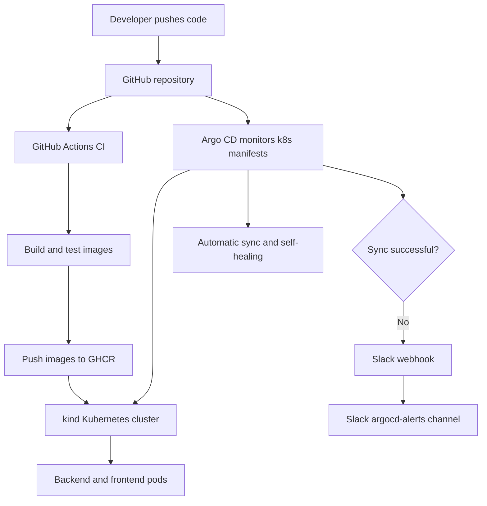

# Week 1 — Microservices & Local Kubernetes Cluster

## Overview
This project contains two small Go microservices, optimized multi-stage Dockerfiles, a Terraform-provisioned local Kubernetes cluster using kind, and raw Kubernetes Deployments and Services.

## Architecture

```text
Client / curl
    |
    v
frontend-service:8081
    |
    v
backend-service:8080
```

The frontend reads `BACKEND_URL=http://backend-service:8080` and calls the backend through Kubernetes service discovery.

## Repository Structure

```text
backend/       Backend source code and Dockerfile
frontend/      Frontend source code and Dockerfile
terraform/     Terraform configuration for the local kind cluster
k8s/           Raw Kubernetes YAML manifests
screenshots/   Evidence captured during testing
```

## Prerequisites
- Linux VM
- Git
- Docker
- kubectl
- kind
- Terraform
- Helm

Record the installed versions here:

```bash
git --version
docker --version
kubectl version --client
kind version
terraform version
helm version 
'''

Installed versions used:

- Git: 2.53.0
- Docker: 28.5.2+dfsg4
- kubectl: v1.36.3
- Kustomize: v5.8.1
- kind: v0.32.0
- Terraform: v1.15.8
- Helm: v4.2.3

## 1. Build the Images

```bash
docker build -t week1-backend:v1 ./backend
docker build -t week1-frontend:v1 ./frontend
docker images | grep week1
```

## 2. Test the Containers Locally

```bash
docker network create week1-net

docker run -d --name backend \
  --network week1-net \
  -p 8080:8080 \
  week1-backend:v1

docker run -d --name frontend \
  --network week1-net \
  -p 8081:8081 \
  -e BACKEND_URL=http://backend:8080 \
  week1-frontend:v1

curl http://localhost:8080/health
curl http://localhost:8081/

docker rm -f frontend backend
docker network rm week1-net
```

## 3. Provision the Cluster with Terraform

```bash
cd terraform
terraform fmt -check
terraform init
terraform validate
terraform plan
terraform apply
export KUBECONFIG="$PWD/kubeconfig"
kubectl cluster-info
kubectl get nodes
cd ..
```

## 4. Load Images into kind

```bash
kind load docker-image week1-backend:v1 --name week1-cluster
kind load docker-image week1-frontend:v1 --name week1-cluster
```

## 5. Deploy Raw Kubernetes Manifests

```bash
kubectl apply -f k8s/namespace.yaml
kubectl apply -f k8s/backend.yaml
kubectl apply -f k8s/frontend.yaml
kubectl wait --for=condition=Available deployment/backend -n week1 --timeout=120s
kubectl wait --for=condition=Available deployment/frontend -n week1 --timeout=120s
kubectl get all -n week1
```

## 6. Verify Internal Communication with kubectl exec and curl

```bash
kubectl run curlbox -n week1 \
  --image=curlimages/curl:8.12.1 \
  --command -- sleep 3600

kubectl wait --for=condition=Ready pod/curlbox -n week1 --timeout=120s
kubectl exec -n week1 curlbox -- curl -s http://backend-service:8080/health
kubectl exec -n week1 curlbox -- curl -s http://frontend-service:8081/
kubectl delete pod curlbox -n week1
```

## 7. Test from the VM

```bash
kubectl port-forward -n week1 service/frontend-service 8081:8081
```

In another terminal:

```bash
curl http://localhost:8081/
```

## Expected Result
The frontend response should contain its own message and the JSON returned by the backend, proving that both services are running and communicating through the Kubernetes Service.

## Troubleshooting

### Docker permission denied
Log out of Kali and log back in after adding your user to the `docker` group. Check with:

```bash
groups
docker ps
```

### ImagePullBackOff
Reload both local images into the named kind cluster and confirm the manifests use versioned tags with `imagePullPolicy: IfNotPresent`.

### kubectl cannot reach the cluster

```bash
cd terraform
export KUBECONFIG="$PWD/kubeconfig"
kubectl get nodes
```

### Pod logs and details

```bash
kubectl get pods -n week1
kubectl describe pod -n week1 <pod-name>
kubectl logs -n week1 deployment/backend
kubectl logs -n week1 deployment/frontend
```

## Cleanup

```bash
kubectl delete namespace week1
cd terraform
terraform destroy
cd ..
```

## Evidence to Include
Add screenshots or copied terminal output for:
1. Prerequisite versions.
2. Successful local Docker test.
3. `terraform apply` and `kubectl get nodes`.
4. `kubectl get all -n week1`.
5. Both `kubectl exec ... curl` commands.
6. Final frontend response.

## What I Built and My Approach
I built two simple Go HTTP microservices: a frontend service and a backend service. I used multi-stage Dockerfiles so the applications could be compiled in one stage and copied into smaller final images. I used kind because it provides a lightweight local Kubernetes cluster through Docker. Terraform was used to create the cluster, while raw Kubernetes Deployment and Service manifests were used to deploy both applications. I verified the setup by checking the pods and services, using kubectl exec with curl for internal communication, and testing the frontend through port forwarding.

---

# Week 2 — Helm, Istio and Strict mTLS

## Overview

In Week 2, the Week 1 raw Kubernetes manifests were converted into a reusable Helm chart. Istio was then installed on the local kind cluster, automatic Envoy sidecar injection was enabled, and strict mutual TLS was enforced between the frontend and backend services.

The final environment includes:

- Frontend and backend managed through Helm
- Istio control plane installed using Helm
- Automatic Envoy sidecar injection
- Strict namespace-wide mTLS
- Successful communication between injected workloads
- Blocked plaintext access from an un-injected pod
- Prometheus metrics collection
- Kiali service-mesh topology visualization

## Architecture

```text
curl-injected pod
        |
        | Istio mTLS
        v
frontend-service:8081
        |
        | Istio mTLS
        v
backend-service:8080

```

## Project Structure

```text
helm/week2-microservices/
├── Chart.yaml
├── values.yaml
└── templates/
    ├── backend-deployment.yaml
    ├── backend-service.yaml
    ├── frontend-deployment.yaml
    └── frontend-service.yaml

istio/
├── strict-mtls.yaml
└── test-pods.yaml

evidence/
├── week2-final-status.txt
└── week2-mtls-test.txt
```

## Helm Deployment

The Week 1 raw Kubernetes manifests were converted into a reusable Helm chart.

Validate and install the chart:

```bash
helm lint helm/week2-microservices

helm install week2-app helm/week2-microservices \
  --namespace week2 \
  --create-namespace \
  --wait \
  --timeout 5m
```

Verify the release:

```bash
helm list -n week2
kubectl get all -n week2
```

## Istio Installation

Istio was installed using the official Helm repository:

```bash
helm repo add istio https://istio-release.storage.googleapis.com/charts
helm repo update
```

The Istio base resources and control plane were installed:

```bash
helm install istio-base istio/base \
  --version 1.30.3 \
  --namespace istio-system \
  --create-namespace \
  --set defaultRevision=default \
  --wait

helm install istiod istio/istiod \
  --version 1.30.3 \
  --namespace istio-system \
  --wait
```

## Automatic Sidecar Injection

Automatic Envoy sidecar injection was enabled:

```bash
kubectl label namespace week2 \
  istio-injection=enabled --overwrite

kubectl rollout restart deployment -n week2
```

The frontend and backend pods then showed `2/2 Running`, representing the application container and Istio Envoy sidecar.

## Strict mTLS

Strict mutual TLS was enabled using:

```yaml
apiVersion: security.istio.io/v1
kind: PeerAuthentication
metadata:
  name: strict-mtls
  namespace: week2
spec:
  mtls:
    mode: STRICT
```

Apply and verify:

```bash
kubectl apply -f istio/strict-mtls.yaml
kubectl get peerauthentication -n week2
```

## mTLS Verification

Two test pods were created:

- `curl-injected`: Istio sidecar enabled
- `curl-uninjected`: Istio sidecar disabled

The injected request succeeded:

```bash
kubectl exec -n week2 curl-injected -c curl -- \
  curl -sS http://frontend-service:8081/
```

The frontend successfully contacted the backend.

The un-injected plaintext request failed:

```bash
kubectl exec -n week2 curl-uninjected -c curl -- \
  curl -v --max-time 5 http://backend-service:8080/health
```

Observed result:

```text
Connection reset by peer
curl exit code: 56
```

This proves that strict mTLS blocks communication from workloads without an Istio identity and certificate.

## Prometheus and Kiali

Prometheus and Kiali were installed for monitoring and service-mesh visualization.

Kiali displayed the following traffic path:

```text
curl-injected → frontend-service → backend-service
```

The graph showed 100% successful traffic with no application errors.

## Evidence

Final command output is stored in:

```text
evidence/week2-final-status.txt
evidence/week2-mtls-test.txt
```

## Week 2 Result

The microservices are now:

- Managed through a reusable Helm chart
- Running with Istio Envoy sidecars
- Protected with strict mutual TLS
- Tested against unauthorized plaintext traffic
- Monitored through Prometheus
- Visualized through Kiali

---

# Week 3 — Kong Gateway and CI Pipeline

## Overview

In Week 3, Kong Gateway was installed in the local Kubernetes cluster and configured as the external entry point for the frontend microservice.

The route was secured using:

- API-key authentication
- A rate limit of five requests per minute
- Istio sidecar injection and strict mTLS communication
- Automated GitHub Actions checks
- Automated Docker image publishing to GitHub Container Registry

## Architecture

```text
External client
      |
      | API key
      v
Kong API Gateway
      |
      | Rate limit: 5 requests/minute
      | Istio mTLS
      v
frontend-service:8081
      |
      | Istio mTLS
      v
backend-service:8080
```

## Kong Installation

Kong Gateway and Kong Ingress Controller were installed using the official Helm chart:

```bash
helm repo add kong https://charts.konghq.com
helm repo update

helm upgrade --install kong kong/ingress \
  --version 0.24.0 \
  --namespace kong \
  --values kong/values.yaml \
  --wait \
  --timeout 15m
```

The Kong namespace has automatic Istio sidecar injection enabled:

```bash
kubectl label namespace kong \
  istio-injection=enabled --overwrite
```

Both Kong workloads showed `2/2 Running`, representing the Kong container and Istio Envoy sidecar.

## Kong Route

The Kubernetes Ingress routes external traffic through Kong to the frontend service:

```text
Kong Gateway → frontend-service:8081
```

Route configuration:

```text
kong/frontend-ingress.yaml
```

The following settings were required for compatibility with the Istio service mesh:

```yaml
konghq.com/preserve-host: "false"
```

The frontend Kubernetes Service uses:

```yaml
ingress.kubernetes.io/service-upstream: "true"
```

This makes Kong send traffic through the Kubernetes Service instead of connecting directly to individual Pod IPs.

## API-Key Authentication

The Kong `key-auth` plugin protects the frontend route.

Relevant resources:

```text
kong/key-auth.yaml
```

The configuration includes:

- `KongPlugin` named `frontend-key-auth`
- `KongConsumer` named `week3-client`
- A Kubernetes Secret containing the API-key credential

The actual API key is stored locally outside the Git repository and is not committed to GitHub.

Authentication tests produced:

```text
No API key       → HTTP 401 Unauthorized
Incorrect key    → HTTP 401 Unauthorized
Correct API key  → HTTP 200 OK
```

Example authenticated request:

```bash
curl \
  -H "apikey: <API_KEY>" \
  http://127.0.0.1:8000/
```

## Rate Limiting

The Kong rate-limiting plugin is configured in:

```text
kong/rate-limit.yaml
```

Configuration:

```yaml
plugin: rate-limiting
config:
  minute: 5
  policy: local
```

The plugin is attached to the frontend Ingress together with key authentication:

```text
frontend-key-auth,frontend-rate-limit
```

Six rapid authenticated requests produced:

```text
Requests 1–5 → HTTP 200 OK
Request 6    → HTTP 429 Too Many Requests
```

The sixth response contained:

```json
{
  "message": "API rate limit exceeded"
}
```

## GitHub Actions CI Pipeline

The workflow is stored in:

```text
.github/workflows/week3-ci.yml
```

It runs automatically when code is pushed to the `main` branch.

The workflow performs:

- Go formatting checks
- Go tests
- Go vet
- Go compilation
- Docker image builds
- Authentication to GitHub Container Registry
- Automatic image publishing

The workflow contains four jobs:

```text
Test backend
Test frontend
Build backend image
Build frontend image
```

All four jobs completed successfully.

## Image Tagging Strategy

Both images are published with two tags:

```text
latest
full Git commit SHA
```

Backend image:

```text
ghcr.io/haniazahid531/week1-microservices-local-cluster-backend:latest
ghcr.io/haniazahid531/week1-microservices-local-cluster-backend:<COMMIT_SHA>
```

Frontend image:

```text
ghcr.io/haniazahid531/week1-microservices-local-cluster-frontend:latest
ghcr.io/haniazahid531/week1-microservices-local-cluster-frontend:<COMMIT_SHA>
```

For the successful Week 3 workflow, the commit SHA tag was:

```text
68a7a6a238ade427af9c62aee123f45dfa6bf8e5
```

## Pulling the Published Images

Backend:

```bash
docker pull \
  ghcr.io/haniazahid531/week1-microservices-local-cluster-backend:latest
```

Frontend:

```bash
docker pull \
  ghcr.io/haniazahid531/week1-microservices-local-cluster-frontend:latest
```

## Week 3 Files

```text
.github/workflows/week3-ci.yml

kong/
├── frontend-ingress.yaml
├── key-auth.yaml
├── rate-limit.yaml
└── values.yaml

evidence/
├── week3-kong-status.txt
└── week3-ci-ghcr.txt
```

## Verification Commands

```bash
kubectl get pods,services -n kong
kubectl get ingress -n week2
kubectl get kongplugin,kongconsumer -n week2
helm list -n kong
```

Check the attached plugins:

```bash
kubectl get ingress frontend-kong -n week2 \
  -o jsonpath='{.metadata.annotations.konghq\.com/plugins}'
```

## Week 3 Result

The application is now:

- Exposed through Kong API Gateway
- Protected with API-key authentication
- Limited to five requests per minute
- Connected to the Istio-secured microservices
- Tested automatically after every push
- Built as Docker images automatically
- Published to GitHub Container Registry
- Tagged with both `latest` and the Git commit SHA

# Week 4 — GitOps Continuous Deployment with Argo CD

## Overview

Week 4 implements GitOps continuous deployment using Argo CD. The Kubernetes manifests stored in GitHub are now the desired state of the application. Argo CD continuously compares GitHub with the cluster and automatically synchronizes any differences.

## Argo CD Application

- Application: `week4-microservices`
- Project: `default`
- Repository: `https://github.com/haniazahid531/week1-microservices-local-cluster.git`
- Revision: `main`
- Manifest path: `k8s`
- Destination: `https://kubernetes.default.svc`
- Namespace: `week1`
- Sync policy: Automatic
- Pruning: Enabled
- Self-healing: Enabled

## Container Images

```text
ghcr.io/haniazahid531/week1-microservices-local-cluster-backend:latest
ghcr.io/haniazahid531/week1-microservices-local-cluster-frontend:latest
```

The Kubernetes manifests use `imagePullPolicy: Always` so the latest GHCR images are pulled whenever pods are created.

## GitOps Scaling Test

The backend replica count was changed in `k8s/backend.yaml` from one to two and pushed to GitHub. Argo CD detected the commit and automatically scaled the backend deployment to two Running pods without using `kubectl apply`.

## Self-Healing Test

The live backend deployment was manually scaled to zero replicas. Because self-healing is enabled, Argo CD detected that the cluster no longer matched GitHub and automatically restored the backend deployment.

## Verification

```bash
kubectl get application week4-microservices -n argocd
kubectl get deployments -n week1
kubectl get pods,svc -n week1
kubectl get pods -n week1 -o custom-columns='POD:.metadata.name,IMAGE:.spec.containers[*].image'
```

## Week 4 Result

- Argo CD installed in the local kind cluster
- GitHub repository configured as the deployment source
- Automatic synchronization enabled
- Resource pruning enabled
- Self-healing successfully demonstrated
- Git-driven scaling successfully demonstrated
- Backend and frontend deployed using GHCR images
- Application verified as Healthy and Synced
- Backend running with two replicas


## GitOps Architecture



### Workflow Explanation

1. A developer commits application code or Kubernetes manifest changes to GitHub.
2. GitHub Actions runs the CI pipeline, tests the services, builds container images, and publishes them to GHCR.
3. Argo CD continuously monitors the `k8s` directory on the `main` branch.
4. When Git changes, Argo CD automatically synchronizes the manifests to the local kind Kubernetes cluster.
5. Kubernetes pulls the CI-built backend and frontend images from GHCR.
6. Argo CD self-healing restores any live cluster changes that do not match Git.
7. If a synchronization operation reaches the `Failed` or `Error` phase, Argo CD Notifications sends an Incoming Webhook alert to the Slack `#argocd-alerts` channel.

## Synchronization Time

The initial Argo CD application synchronization started at `06:49:14` and completed at `06:49:17`, giving an observed sync time of approximately **3 seconds**.

A later GitOps scaling test changed the backend from one to two replicas. After the manifest was pushed to GitHub, Argo CD detected and deployed the change automatically without `kubectl apply`.

## Slack Sync-Failure Notifications

Argo CD Notifications is configured with:

- Trigger: `on-sync-failed`
- Failure phases: `Error` and `Failed`
- Delivery method: Slack Incoming Webhook
- Destination channel: `#argocd-alerts`
- Application subscription: `week4-microservices`

A controlled failure was tested by temporarily introducing an invalid immutable Deployment selector. Argo CD retried the synchronization five times and then reported:

```text
Phase: Failed
Retry count: 5
Started: 2026-08-12T17:37:45Z
Finished: 2026-08-12T17:43:42Z
```

The Slack channel successfully received an alert containing the application name, failed phase, and repository URL. The manifest was then restored, pushed to GitHub, and Argo CD returned the application to `Healthy` and `Synced`.

> Security note: The Slack webhook URL is stored only in the Kubernetes Secret `argocd-notifications-secret`. The secret value is not committed to Git.

## Revision Completion

- Argo CD Slack webhook notifications configured
- Real sync-failure alert successfully tested
- Architecture diagram added to the README
- Synchronization time documented
- Application restored to Healthy and Synced after testing


# Week 5 - Observability and Alerting

## Overview

Week 5 adds a complete Kubernetes observability and alerting stack to the existing microservices cluster.

The implementation includes:

- Prometheus for metrics collection
- Grafana for dashboards and visualization
- Alertmanager for alert routing
- Three production-style Prometheus alert rules
- An internal webhook notification channel
- A deliberately triggered test alert
- A documented alert-response runbook
- Simulated application traffic for dashboard verification

## Architecture

Application traffic passes through the Istio proxy. Prometheus collects Istio and Kubernetes metrics. Grafana queries Prometheus and displays request rate, error rate, and P95 latency. Prometheus sends firing alerts to Alertmanager, which routes notifications to the webhook receiver.

Application -> Istio Metrics -> Prometheus -> Grafana

Prometheus Rules -> Alertmanager -> Webhook Receiver

## Monitoring Components

The `kube-prometheus-stack` Helm chart installs:

- Prometheus
- Grafana
- Alertmanager
- Prometheus Operator
- kube-state-metrics
- Prometheus Node Exporter

All monitoring resources run in the `monitoring` namespace.

## Project Files

- `monitoring/values.yaml` - Helm configuration
- `monitoring/istio-podmonitor.yaml` - Istio metrics collection
- `monitoring/alert-rules.yaml` - Three permanent Prometheus alert rules
- `monitoring/test-alert.yaml` - Deliberate alert test
- `monitoring/grafana/dashboards/week5-dashboard.yaml` - Code-provisioned Grafana dashboard
- `monitoring/alertmanager/webhook-receiver.yaml` - Internal webhook receiver
- `monitoring/alertmanager/alertmanager-config.yaml` - Operator-native Alertmanager routing
- `RUNBOOK.md` - Alert investigation and response instructions

## Installation

Set the kubeconfig:

    export KUBECONFIG="$PWD/terraform/kubeconfig"

Add and update the Helm repository:

    helm repo add prometheus-community https://prometheus-community.github.io/helm-charts
    helm repo update

Create the monitoring namespace:

    kubectl create namespace monitoring

Install or update the monitoring stack:

    helm upgrade --install monitoring prometheus-community/kube-prometheus-stack \
      --namespace monitoring \
      --values monitoring/values.yaml \
      --wait \
      --timeout 10m

Apply the custom monitoring resources:

    kubectl apply -f monitoring/istio-podmonitor.yaml
    kubectl apply -f monitoring/grafana/dashboards/week5-dashboard.yaml
    kubectl apply -f monitoring/alert-rules.yaml
    kubectl apply -f monitoring/alertmanager/webhook-receiver.yaml
    kubectl apply -f monitoring/alertmanager/alertmanager-config.yaml

## Access Grafana

Start port forwarding:

    kubectl port-forward -n monitoring svc/monitoring-grafana 3000:80

Open:

    http://127.0.0.1:3000

Local lab credentials:

- Username: `admin`
- Password: `week5admin`

## Custom Grafana Dashboard

Dashboard title:

`Week 5 - Application Observability`

The dashboard is provisioned through a labelled Kubernetes ConfigMap and contains:

1. Request Rate
2. HTTP 5xx Error Rate
3. P95 Request Latency

The dashboard automatically refreshes every 10 seconds.

## Simulated Load

The following command sends 300 requests to the Week 2 frontend:

    kubectl exec -n week2 curl-injected -- sh -c \
      'for i in $(seq 1 300); do curl -s -o /dev/null http://frontend-service:8081/; done; echo "300 requests completed"'

Prometheus collects the resulting Istio request and latency metrics, which appear in Grafana.

## Alert Rules

### HighApplicationLatency

Triggers when P95 application latency remains above 1000 milliseconds for more than two minutes.

### HighApplicationErrorRate

Triggers when HTTP 5xx responses exceed 10 percent of total requests for more than two minutes.

### PodCrashLooping

Triggers when a container restarts more than twice within five minutes.

## Notification Channel

Alertmanager uses the `week5-webhook` receiver.

The notification endpoint is:

    http://week5-alert-receiver.monitoring.svc:8080/

The webhook receiver records notification payloads in its pod logs.

View notifications:

    kubectl logs -n monitoring deployment/week5-alert-receiver --since=5m

## Deliberate Alert Test

The `Week5DeliberateTestAlertV3` rule uses `vector(1)` to deliberately create a firing alert.

Apply the test:

    kubectl apply -f monitoring/test-alert.yaml

Verify the alert notification:

    kubectl logs -n monitoring deployment/week5-alert-receiver --since=5m

The successful payload contains:

- Alert name: `Week5DeliberateTestAlertV3`
- Status: `firing`
- Receiver: `week5-webhook`
- Severity: `test`

Remove the temporary test rule after collecting evidence:

    kubectl delete -f monitoring/test-alert.yaml

## Runbook

`RUNBOOK.md` documents investigation and response procedures for:

- High application latency
- High application error rate
- Repeated pod crashes
- The deliberate Week 5 test alert

## Verification

Check all monitoring pods:

    kubectl get pods -n monitoring

Check alert rules:

    kubectl get prometheusrule -n monitoring

Check the dashboard ConfigMap:

    kubectl get configmap week5-observability-dashboard -n monitoring

Check Alertmanager configuration:

    kubectl get alertmanagerconfig -n monitoring

## Week 5 Result

The final system provides code-provisioned dashboards, Kubernetes and Istio metrics, three permanent alert rules, a tested notification channel, simulated-load evidence, and documented incident-response procedures.

---

# Week 6 - Canary Deployments and Platform Polish

## Overview

Week 6 replaces the backend Kubernetes Deployment with an Argo Rollout. The rollout shifts capacity through 20%, 50%, and 100% stages and uses Prometheus analysis to decide whether a revision should be promoted or automatically rolled back.

## Architecture

    Developer
        |
        | git push
        v
    GitHub Actions
        |
        | builds and pushes GHCR images
        v
    GitHub Repository <---- Argo CD watches main/k8s
                                |
                                v
                         Argo Rollouts Controller
                                |
                  +-------------+-------------+
                  |                           |
             Stable Pods                 Canary Pods
                  |                           |
                  +------ backend-service ---+
                                |
                         Istio Metrics
                                |
                           Prometheus
                                |
                     AnalysisTemplate decision
                         |               |
                      promote         rollback

    Client --> Kong key-auth/rate-limit --> Frontend --> Backend

## Week 6 Files

- `k8s/backend.yaml`: backend Rollout and Service
- `k8s/backend-analysis.yaml`: Prometheus AnalysisTemplate
- `rollouts/values.yaml`: reproducible Helm values
- `rollouts/install-argo-rollouts.sh`: idempotent installation script
- `rollouts/ROLLBACK.md`: tested rollback and recovery procedure
- `istio/frontend-kong-mtls.yaml`: frontend-only Kong mTLS compatibility policy
- `screenshots/week6/`: Week 6 test evidence

## Install Argo Rollouts

Ensure `KUBECONFIG` points to the cluster:

    export KUBECONFIG="$PWD/terraform/kubeconfig"

Install or upgrade Argo Rollouts:

    ./rollouts/install-argo-rollouts.sh

Verify installation:

    kubectl get pods -n argo-rollouts
    kubectl get crd rollouts.argoproj.io analysistemplates.argoproj.io

## Deploy Through GitOps

The Argo CD application `week4-microservices` watches the `k8s` directory on the `main` branch.

Validate manifests before pushing:

    kubectl apply --dry-run=client \
      -f k8s/backend-analysis.yaml \
      -f k8s/backend.yaml

Commit and push:

    git add k8s/backend.yaml k8s/backend-analysis.yaml
    git commit -m "feat: update backend canary"
    git push origin main

Request an immediate Argo CD refresh when required:

    kubectl annotate application week4-microservices \
      -n argocd \
      argocd.argoproj.io/refresh=hard \
      --overwrite

## Canary Strategy

The backend Rollout contains five replicas and performs:

1. `setWeight: 20`
2. 30-second pause
3. Prometheus analysis
4. `setWeight: 50`
5. 30-second pause
6. Prometheus analysis
7. `setWeight: 100`

Watch it with:

    kubectl argo rollouts get rollout backend -n week1 --watch

A healthy completed rollout displays:

- Status `Healthy`
- Step `7/7`
- SetWeight `100`
- Five ready and available replicas

## Metric-Driven Promotion

The AnalysisTemplate queries `istio_requests_total` from Prometheus and calculates the HTTP 5xx error proportion.

The canary passes when the result is at or below 5%. Empty Prometheus results safely evaluate to zero using `or vector(0)`.

## Automated Rollback

A controlled failure test proved that a failed Prometheus assessment automatically:

- aborted the new revision;
- scaled down the canary ReplicaSet;
- preserved five healthy stable pods; and
- prevented service interruption.

The full procedure and manual recovery commands are documented in `rollouts/ROLLBACK.md`.

## Final End-to-End Verification

The final tested delivery path was:

1. A change was pushed to GitHub.
2. `.github/workflows/week3-ci.yml` completed successfully.
3. Backend and frontend images were built and pushed to GHCR.
4. Argo CD synchronized the matching Git revision.
5. Argo Rollouts completed Prometheus-gated canary promotion.
6. Kong accepted an authenticated request and returned HTTP 200.
7. Prometheus returned active `istio_requests_total` series.

Check recent CI runs:

    curl -s \
      "https://api.github.com/repos/haniazahid531/week1-microservices-local-cluster/actions/runs?per_page=5" \
      | jq -r '.workflow_runs[] | [.head_sha[0:7], .status, .conclusion] | @tsv'

Check Argo CD:

    kubectl get application week4-microservices -n argocd \
      -o jsonpath='{.status.sync.revision}{" "}{.status.sync.status}{" "}{.status.health.status}{"\n"}'

Check Prometheus:

    kubectl exec -n week2 curl-injected -- \
      curl -sG \
      --data-urlencode 'query=count(istio_requests_total)' \
      http://monitoring-kube-prometheus-prometheus.monitoring.svc:9090/api/v1/query

## Kong and Istio Compatibility

The `week2` namespace keeps namespace-wide `STRICT` mTLS. Kong is not sidecar-injected, so `istio/frontend-kong-mtls.yaml` permits plaintext or mTLS only for frontend pods.

Apply the policy:

    kubectl apply -f istio/frontend-kong-mtls.yaml

Kong key authentication remains enabled. The API key is read from the Kubernetes Secret and must never be committed or printed.

## Reproducing the Platform

1. Provision the local cluster using the existing Terraform configuration.
2. Export `KUBECONFIG="$PWD/terraform/kubeconfig"`.
3. Follow the Week 1-5 setup sections to deploy Istio, Kong, Argo CD, applications, and monitoring.
4. Run `./rollouts/install-argo-rollouts.sh`.
5. Apply `istio/frontend-kong-mtls.yaml`.
6. Push the `k8s` manifests so Argo CD synchronizes the Rollout and AnalysisTemplate.
7. Verify all namespaces and workloads with `kubectl get pods -A`.
8. Run the end-to-end verification commands above.

All installation configuration, manifests, policies, rollback instructions, and evidence required for reproduction are stored in Git.

## Week 6 Evidence

- Successful canary: `screenshots/week6/01-successful-canary.png`
- Automated rollback: `screenshots/week6/02-automated-rollback.png`
- Successful CI: `screenshots/week6/03-ci-success.png`
- Kong HTTP 200: `screenshots/week6/04-kong-route-success.png`
- Prometheus metrics: `screenshots/week6/05-prometheus-metrics.png`

## Week 6 Result

The platform now provides automated metric-driven canary deployments, Prometheus-based promotion gates, tested automatic rollback, authenticated Kong routing, GitOps synchronization, CI-built container images, and reproducible installation documentation.
